# Simple Hugo Portfolio Template

Simple hugo portfolio example derived from the forty theme. Designed to be used for Data Scientists sharing their R projects.

Inspired by Emi Tanaka's Showcase page: https://emitanaka.org/showcase/

Take a look at the example website: https://hugo-portfolio-example.netlify.app/

## How does this work?

These steps will make a copy of this repository to your own GitHub account and connect it to a web host called Netlify. 

Netlify handles most of the hard stuff (such as making html from your text and formatting), so you can concentrate on making content. It does this by using what's called a webpage rendering engine (called Hugo) to transform your text to the HTML web format.

To get started, you can work from the GitHub and Netlify sites directly. 

## Getting Started

1. To get started, sign up for [GitHub](https://github.com) and [Netlify](https://netlify.com) accounts and then click the following button.

[](https://app.netlify.com/start/deploy?repository=https://github.com/laderast/portfolio-example)

2. You'll then be asked to connect your Netlify account to GitHub. Click the `Connect to GitHub` button.

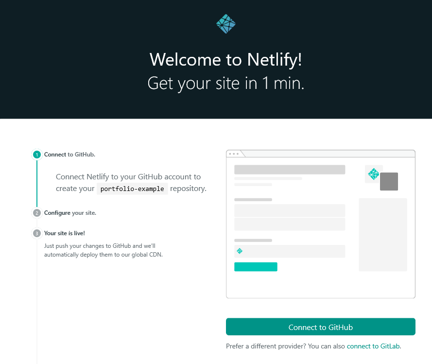

3. Name your repository anything you want:

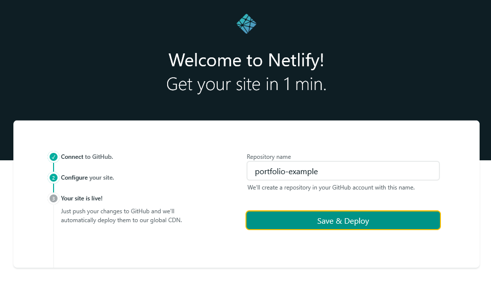

then click the `Save and Deploy` button:

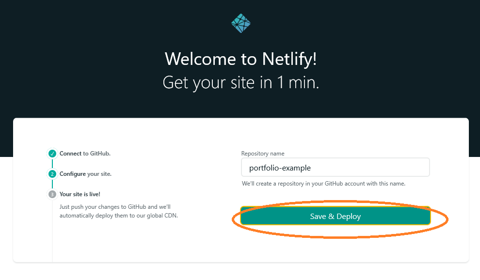

If you haven't authorized Netlify to connect to your account, you'll be asked to authorize it. Make sure to authorize before moving on.

4. You'll then move on to what's called the `deploy` page. Notice that in the top right, there is a yellow **deploy in progress** indicator. Wait a second.

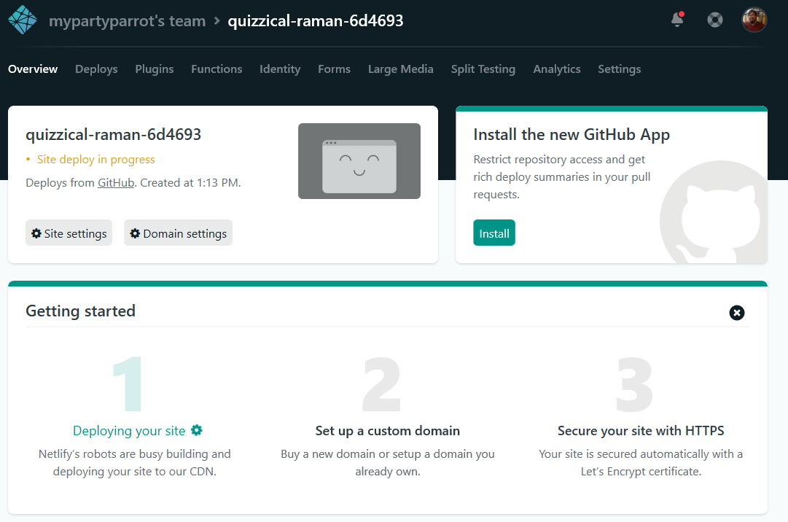

5. You'll now see a green link in the top left corner. Click on it, and you'll see your brand new site!


Here's your brand new site:

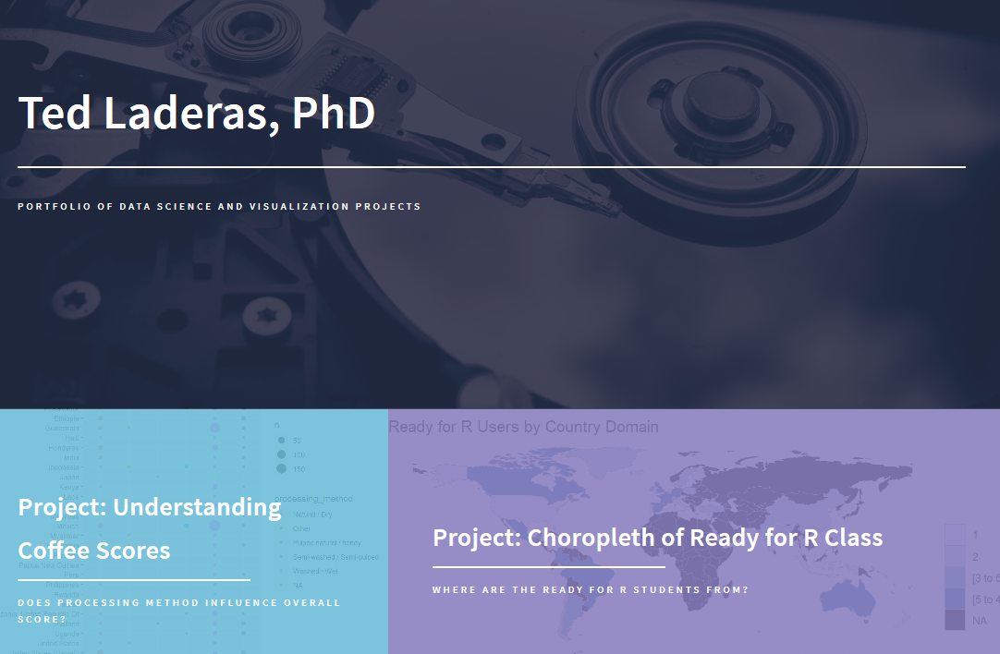

## Changing your domain Name

1. That crazy name is the address of your site. To change it, you can click on the **Domain Settings** button: 

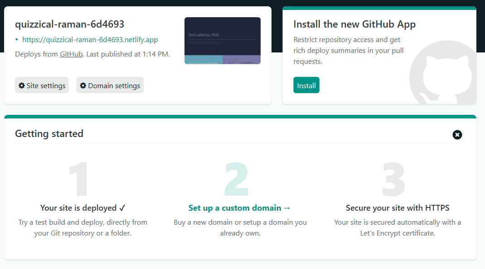

2. In the following page, click the **Options >> Edit Site Name** button. You can change the first part of the domain, such as "myportfolio.netlify.app).


## Customizing Your Site

1. Now you should start customizing your site. You can do most of the updating on your GitHub Repository page. To find it, you can click the "GitHub" Link in your deploy page, or find it at https://github.com/YOURUSERNAME/REPONAME, where YOURUSERNAME is your GitHub User Name, and REPONAME is the name of your repository. 

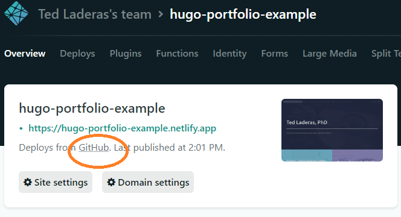

2. Click on the `config.toml` file and edit it (use the pencil in the top right corner) to start editing it.

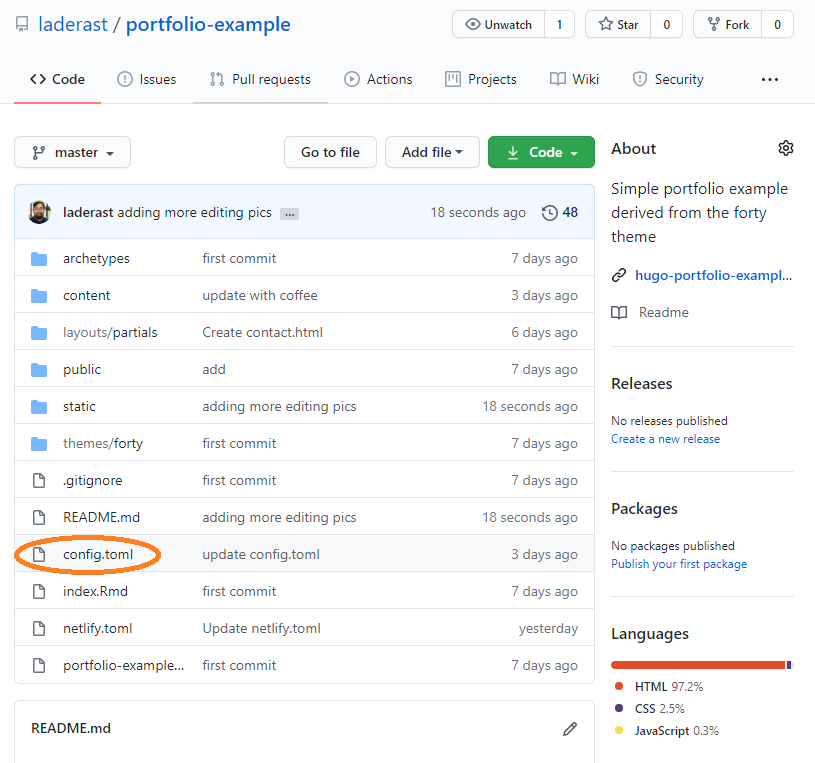
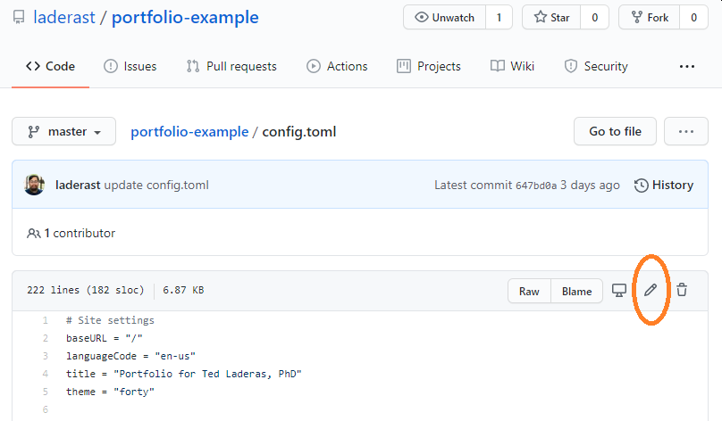


Almost all elements are edited within the `config.toml` file. At the bare minimum, these are the fields you should customize.

Start by changing the fields with your name:

```
title = "Portfolio for Ted Laderas, PhD"
```

```
name = "Ted Laderas"
description = "Portfolio/CV for Ted Laderas"
```

Menu can be modified here. If you're not sure about this part, you can leave it be, other than changing the `title` and `subtitle`.

```
  [params.navigation]
    title = "Ted Laderas, PhD"
    subtitle = "Data Scientist and Collaborator"
    menu = "Menu"
    # Optional logo as brand stored in img/
    # logo = "logo.png"

    [[params.navigation.links]]
      name = "Home"
      url = "#"

    [[params.navigation.links]]
      name = "Blog"
      url = "blogs"

```

3. Edit the Banner information as well: 

```
  # Banner section
  [params.banner]
    # To change the background image on the homepage banner, replace 'banner.jpg' in
    # the 'static/img' folder.
    title = "Ted Laderas, PhD"
    subtitle = "Portfolio of Data Science and Visualization Projects"

```

4. You can also edit your personal information:

```
v# Contact Section
    # You can add multiple emails, phone numbers, or addresses
    # by copying the corresponding map with frontmatter code.
    [[params.contact.email]]
    title = "Email"
    email = "tedladeras (at) gmail.com"

    [[params.contact.phone]]
    title = "Phone"
    phone = "(000) 000-0000 x1234"

    [[params.contact.address]]
    title = "Address"
    street = "3181 SW Sam Jackson Road"
    city = "Portland, OR 97212"
    country = "USA"

  # Footer section
  [params.footer]
    enable = true
    copyright = "Ted Laderas"

    # Uses font awesome icons
    [[params.footer.social]]
      icon = "fa-twitter"
      url= "https://www.twitter.com/tladeras"
      label = "Twitter"

    #[[params.footer.social]]
     # icon = "fa-facebook"
      #url= "https://www.facebook.com"
      #label = "Facebook"

    #[[params.footer.social]]
     # icon = "fa-instagram"
      #url= "https://www.instagram.com"
      #label = "Instagram"
    
    [[params.footer.social]]
      icon = "fa-github"
      url= "https://www.github.com/laderast"
      label = "GitHub"

    [[params.footer.social]]
      icon = "fa-linkedin"
      url= "https://www.linkedin.com/in/ted-laderas-0714a92/"
      label = "LinkedIn"
 ```

5. When you're done editing, click the green `Commit Changes` at the bottom of the edit window to save your changes. 

Wait a second. By the magic of Netlify, your site will be rebuilt with your settings. 

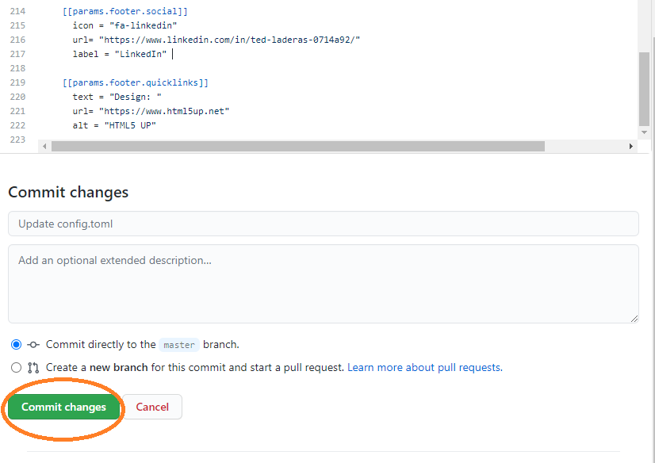

Bask in your brand new site!


For more info on customizing, look at the theme page: https://themes.gohugo.io/forty/

## Adding your projects

Adding a project as a tile on your main page is a three part process. You can put in knitted `.html` RMarkdown files, or links to other websites (such as a https://shinyapp.io shiny app).

1. Add a project Rmarkdown by adding a folder in the `content/projects` directory, and name your 
RMarkdown html file `index.html` in the folder. The easiest way to do this is to create the folder on your machine with your `index.html` file in it, and then go to to **Add File >> Upload File**:

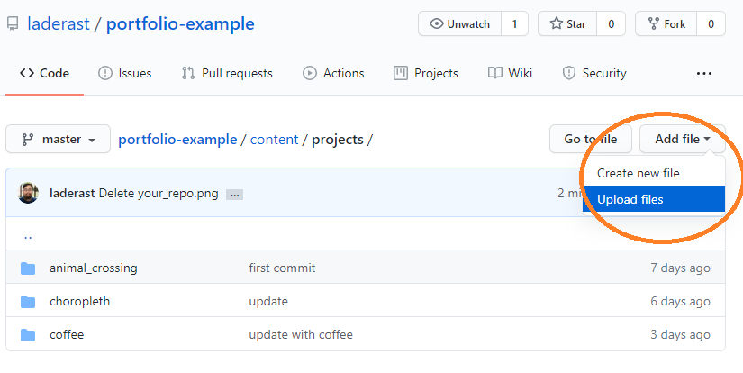

2. Drag and drop your folder with the `index.html` file in there. Save your changes by using the green `Commit Changes` button at the bottom of the page.

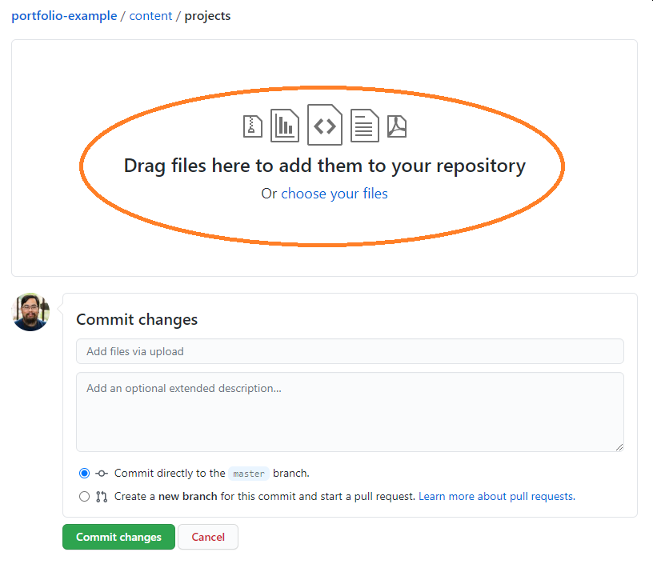

You'll refer to the `url` as `projects/FOLDERNAME` (for example: `projects/choropleth`) Look in the `content/projects` folder for other examples.

3. (optional) Add an image for each tile in `static/image/projects/`, and refer to them in the `image` field as `projects/choropleth.png`.

4. Now add a `[[params.tiles.showcase]]` entry for your tile. It's probably easiest to copy and paste one of the tiles and edit it for right now.

You'll want to add your `url` to the `url` field, and if you have an `image`, add it to the `image` field. Make sure to edit the `title` and `subtitle`!

```
 [params.tiles]
    enable = true
    # Display your showcases here.
    
    [[params.tiles.showcase]]
      title = "Choropleths for Ready for R Class"
      subtitle = "Understanding our email list by country domain"
      image = "projects/choropleth.png"
      url = "projects/choropleth"

    [[params.tiles.showcase]]
      title = "Animal Crossing Tidy Tuesday"
      subtitle = "Understanding Character and Animal Types in Animal Crossing"
      image = "projects/ac.png"
      url = "projects/animal_crossing"
```

Enjoy your updated portfolio! If you have a lot of projects, make sure to pick and choose, and have a good `title` and `subtitle`. I like to use my research question in the `subtitle`, such as "Where are the Ready for R Students from?"

## Next Step: Cloning your project to your desktop

The next thing you'll want to do is save a local copy to your machine. 

That way, you can edit it in RStudio using the `blogdown` package and work on it on your machine.

Please look at [Happy Git and GitHub for the useR](https://happygitwithr.com/) for more info on how to clone a project to your machine. 

## Going Further

This is just the tip of the iceberg. With some more learning, you'll be able to customize this site even further.

* Learn more about Netlify, RMarkdown, and hugo file structure by watching [Sharing Online on Short Notice](http://rstd.io/sharing).

* Learn a bit about how Git and GitHub work by checking out [Happy Git and GitHub for the useR](https://happygitwithr.com/). 

* Then introduce yourself to the `blogdown` package via [blogdown: Creating Websites with RMarkdown](https://bookdown.org/yihui/blogdown/).

* Learn more about the hugo `forty` theme, which this website is based on: https://themes.gohugo.io/forty/

Be sure to share your web link with us! We want to see what you do with this.

Happy portfolios!
Ted
